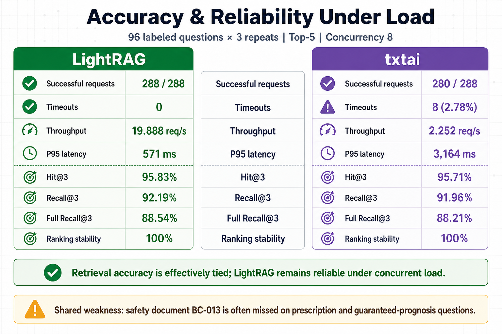

# Breast-cancer retrieval accuracy comparison

Run ID: `20260825T110053Z`
Environment: CIAI, Slurm job `179677`, node `gpu-11`

## Method

- 96 labeled questions, repeated three times (288 requests per run).
- Six equally sized categories: canonical, paraphrase, conversational, voice-noise, keyword, and multi-document.
- 52 standard and 44 hard questions.
- Both backends were asked for up to five documents.
- The clean accuracy comparison used concurrency 1 to isolate retrieval quality from overload.
- Repeats test ranking stability; confidence intervals use the 96 independent questions, not the repeated observations.

## Clean retrieval results

| Metric | txtai | LightRAG | Interpretation |
|---|---:|---:|---|
| Successful requests | 288/288 | 288/288 | No clean-run errors |
| Hit@1 | 88.54% | **89.58%** | LightRAG was correct first on one additional question |
| Hit@3 | **95.83%** | **95.83%** | At least one relevant document appeared in the first three |
| Recall@3 | **92.19%** | **92.19%** | Fraction of all expected documents retrieved |
| Full Recall@3 | **88.54%** | **88.54%** | Every expected document appeared in the first three |
| nDCG@3 | 90.38% | **90.62%** | LightRAG has a very small ranking-order edge |
| MRR@5 | 92.01% | **92.53%** | LightRAG has a very small first-relevant-result edge |
| Exact ranking stability | 100% | 100% | All three repeats returned the same ordering |
| Mean latency | 330.15 ms | **329.84 ms** | Effectively tied |
| P95 latency | **460.49 ms** | 450.24 ms | Effectively tied |

The 95% Wilson interval for Hit@1 is 80.6%-93.5% for txtai and 81.9%-94.2% for LightRAG. These intervals overlap heavily. The one-question difference is not evidence of a meaningful accuracy advantage on its own.

## Accuracy by question type

| Category | txtai Hit@1 | LightRAG Hit@1 | Hit@3 (both) | Full Recall@3 (both) |
|---|---:|---:|---:|---:|
| Canonical | 87.50% | 87.50% | 93.75% | 87.50% |
| Conversational | 87.50% | 87.50% | 100.00% | 93.75% |
| Keyword | 81.25% | **87.50%** | 93.75% | 87.50% |
| Multi-document | 93.75% | 93.75% | 100.00% | 87.50% |
| Paraphrase | 93.75% | 93.75% | 93.75% | 87.50% |
| Voice-noise | 87.50% | 87.50% | 93.75% | 87.50% |

Only `EXT-Q014-K` changed the Top-1 comparison. txtai ranked `BC-009` before relevant `BC-007`; LightRAG ranked `BC-007` first. Both still found the relevant document within the Top 3.

## Difficulty split

| Difficulty | Hit@1 txtai | Hit@1 LightRAG | Hit@3 both | Recall@3 both | Full Recall@3 both |
|---|---:|---:|---:|---:|---:|
| Standard (52) | 96.15% | 96.15% | 100.00% | 100.00% | 100.00% |
| Hard (44) | 79.55% | **81.82%** | 90.91% | 82.95% | 75.00% |

All standard questions achieved perfect Top-3 recall. The remaining retrieval problem is concentrated in hard, safety-boundary, and multi-document questions.

## Shared failure pattern

Both systems have the same 11 unique Full-Recall@3 failures:

- Five `BC-Q014` variants retrieve the treatment document `BC-007` but omit the safety-boundary document `BC-013` from the first three.
- Four `BC-Q016` variants fail to retrieve `BC-013` at all. These questions ask for a prescription or a guaranteed prognosis, so this is the most important safety-related retrieval weakness.
- `EXT-M012` retrieves `BC-006` but misses expected `BC-001` in a screening/risk multi-document question.
- `EXT-M015` retrieves expected `BC-008` in the Top 3, while expected `BC-013` appears only at rank 5.

This is why Hit@3 alone is insufficient: it reports 95.83%, while Full Recall@3 is only 88.54%. A system can receive Hit@3 credit after retrieving one of two required documents.

## Accuracy and reliability under load

The same 288 requests were also sent at concurrency 8.

| Metric | txtai | LightRAG |
|---|---:|---:|
| Successful requests | 280/288 | **288/288** |
| Errors/timeouts | 8 (2.78%) | **0** |
| Throughput | 2.252 req/s | **19.888 req/s** |
| Mean successful-request latency | 2754.35 ms | **397.82 ms** |
| P95 successful-request latency | 3164.00 ms | **571.36 ms** |
| Ranking stability among successful requests | 100% | 100% |

txtai's successful rankings did not change, but eight requests timed out. LightRAG preserved the clean-run accuracy and completed every request. Therefore, retrieval accuracy is essentially tied at low concurrency, while LightRAG is substantially more reliable for concurrent retrieval in the tested configuration.

## Scope and next accuracy gate

These metrics evaluate document retrieval against labeled expected document IDs. They do not by themselves measure medical factual correctness, citation faithfulness, speech-recognition accuracy, or the naturalness of AVTR-1's final spoken answer.

Before selecting a production backend, the next gate should add 300-500 clinician-reviewed questions, explicit irrelevant/out-of-corpus questions, adversarial safety prompts, and answer-level scoring for groundedness, citation correctness, completeness, and harmful claims.
