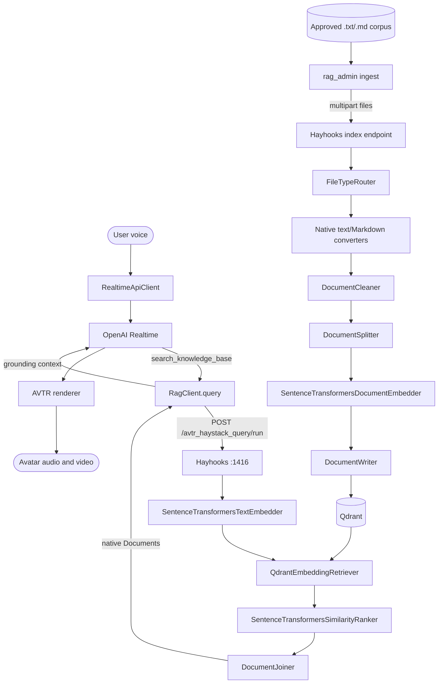

# AVTR-1 + Haystack architecture

This variant keeps OpenAI Realtime as the only answer and speech generator.
Hayhooks serves two native Haystack pipelines; Qdrant stores the embedded
evidence.

Hayhooks owns HTTP routing, validation, status, deployment discovery, and
OpenAPI generation. AVTR does not define a FastAPI service. Custom code is
limited to the two required `BasePipelineWrapper` classes and AVTR's existing
backend normalization boundary.

Generated endpoints:

- `GET /status`
- `POST /avtr_haystack_index/run`
- `POST /avtr_haystack_query/run`
- `GET /openapi.json`

Hayhooks 1.24 includes the typed request/response definitions in OpenAPI; it
does not create separate per-pipeline schema routes.
