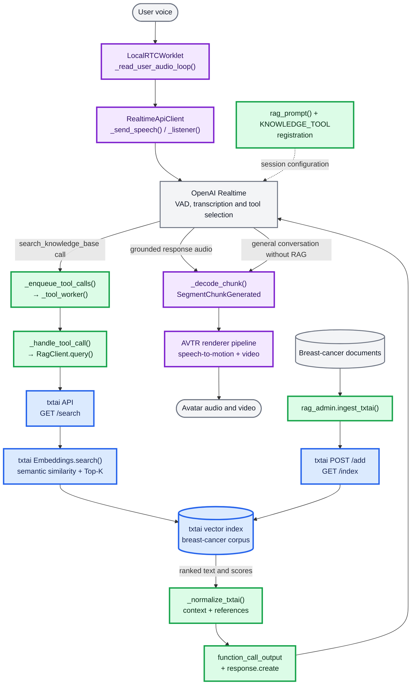

# AVTR-1 + txtai architecture

This is the runtime and ingestion architecture without audit/logging steps.

## Boundary legend

- Purple: original AVTR-1 functions.
- Blue: original txtai/RAG functions.
- Green: functions created to integrate AVTR-1 with txtai.
- Grey: external actors, hosted services, source data, and final output.

The integration boundary is implemented mainly in
`src/avaturn_live_streamer/conversation_engines/rag_client.py` and the RAG tool
handling added to `realtime_api_client.py`. The controlled retrieval endpoint is
`http://127.0.0.1:8001/search`.
