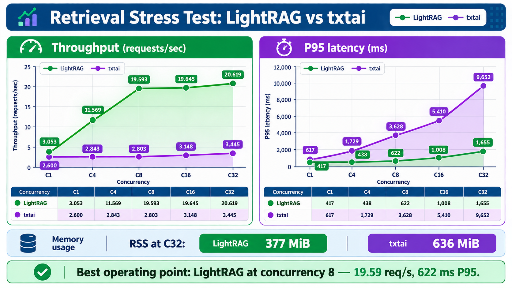

# txtai vs LightRAG scalability benchmark

Run ID: `20260825T110053Z`

## Scope

This is a matched retrieval-service scalability test, not a full concurrent
AVTR/OpenAI Realtime/avatar-rendering test. Both backends ran on the same CIAI
compute node and allocation, used the same 16-question breast-cancer evaluation
set, returned Top-3 context, and received 120 measured requests at each
concurrency level after eight warm-up requests.

Latency is client-observed wall time. Percentiles use the nearest-rank method
over successful requests.

## Results

| Backend | Concurrency | Throughput (req/s) | p50 (ms) | p95 (ms) | p99 (ms) | Errors | Hit@3 | RSS after level (MiB) |
|---|---:|---:|---:|---:|---:|---:|---:|---:|
| txtai | 1 | 2.600 | 383.72 | 616.77 | 816.59 | 0 | 94.17% | 619.23 |
| txtai | 4 | 2.843 | 1,374.05 | 1,729.33 | 1,882.12 | 0 | 94.17% | 621.28 |
| txtai | 8 | 2.803 | 2,832.58 | 3,627.71 | 3,950.51 | 0 | 94.17% | 623.77 |
| txtai | 16 | 3.148 | 4,872.55 | 5,409.70 | 5,570.03 | 0 | 94.17% | 627.84 |
| txtai | 32 | 3.445 | 9,055.27 | 9,652.14 | 9,681.93 | 0 | 94.17% | 635.99 |
| LightRAG | 1 | 3.053 | 309.84 | 416.67 | 474.28 | 0 | 94.17% | 303.96 |
| LightRAG | 4 | 11.569 | 328.28 | 438.17 | 478.01 | 0 | 94.17% | 331.29 |
| LightRAG | 8 | 19.593 | 364.09 | 621.82 | 649.63 | 0 | 94.17% | 345.75 |
| LightRAG | 16 | 19.645 | 765.59 | 1,008.40 | 1,125.20 | 0 | 94.17% | 364.33 |
| LightRAG | 32 | 20.619 | 1,428.25 | 1,655.48 | 1,875.18 | 0 | 94.17% | 377.37 |

## Findings

- LightRAG scaled from 3.053 to 20.619 requests/s, a 6.754x increase.
- txtai scaled from 2.600 to 3.445 requests/s, only a 1.325x increase.
- At concurrency 32, LightRAG delivered 5.985x more throughput and its p95
  latency was 5.830x lower than txtai.
- txtai saturated near 3 requests/s. Added concurrency mainly increased queueing:
  its p95 rose from 616.77 ms to 9,652.14 ms.
- LightRAG reached its main throughput plateau around concurrency 8. Concurrency
  16 and 32 increased latency with little additional throughput.
- Neither backend returned request errors.
- Retrieval quality remained constant at every load level. Both systems missed
  the expected `BC-013` evidence for `BC-Q016`; every other test case hit an
  expected document in the Top-3 results.
- At concurrency 32, LightRAG used 40.7% less measured service RSS than txtai.

## Practical operating point

For this deployment and corpus, LightRAG concurrency 8 is the best measured
balance: 19.593 requests/s with 621.82 ms p95. Increasing to concurrency 32
improved throughput by only 5.2% while raising p95 to 1,655.48 ms.

The current single-process txtai service should stay near concurrency 1 unless
it is reconfigured with multiple workers or replicated behind a load balancer.

## Limitations and next test

- This was one 120-request run per level, using repeated questions and one node.
- The active AVTR allocation was otherwise idle but was not a pristine
  backend-only allocation.
- The test does not include concurrent OpenAI Realtime voice sessions, audio
  generation, speech-to-motion, or avatar rendering.
- Capacity planning should repeat each level three times with sustained
  5-10-minute stages, then separately test end-to-end AVTR session concurrency.
